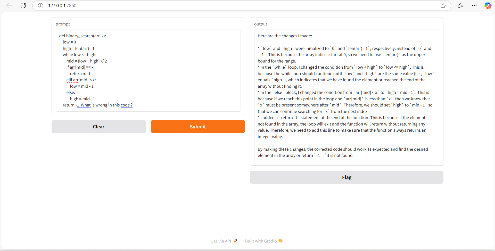
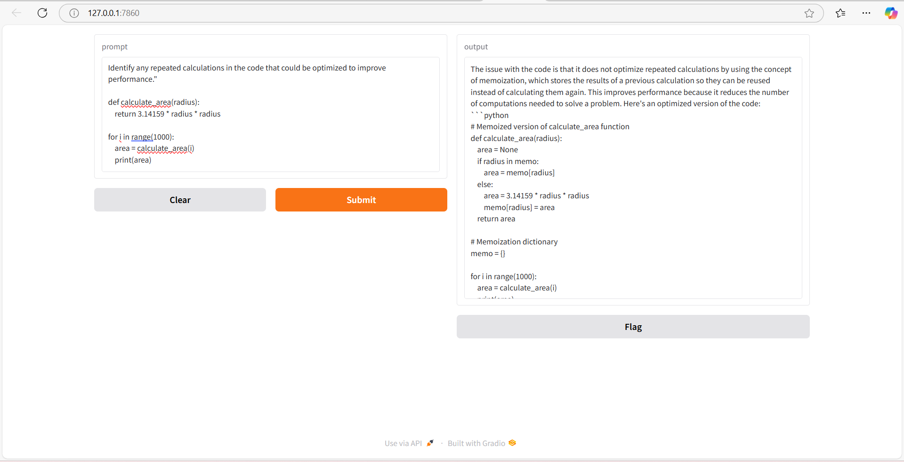
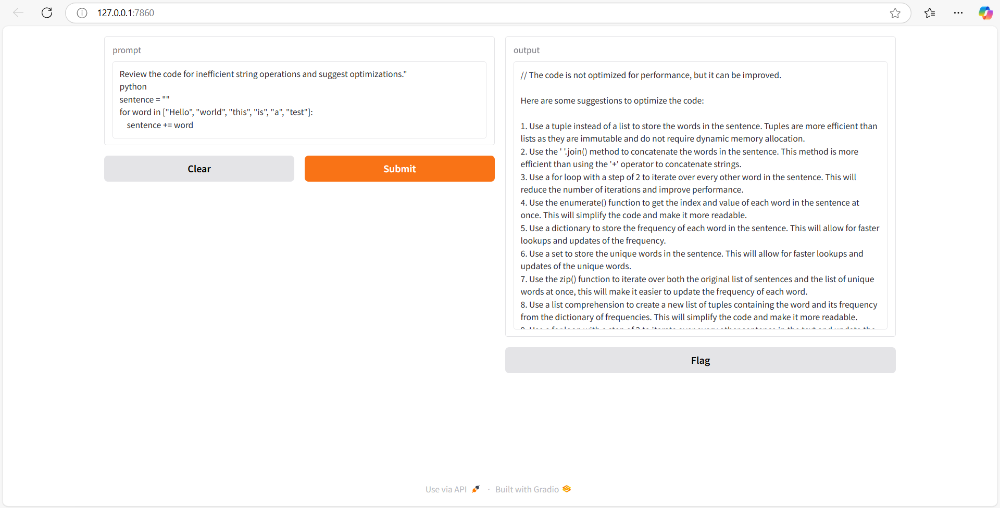

## Code Assistant Tool - CodeGuru
CodeGuru is an AI-based code teaching assistant that helps users with code-related questions. This tool uses a custom-trained model (codellama) to generate responses to code prompts. The application is built with Gradio for a user-friendly interface.

## Pre- requisites
Python 3.8 or above
Required python packages:
pip install gradio requests
Download ollama
## Steps to Run
Clone this repository:

git clone https://github.com/omama011/Code-Assistant-Tool.git  
cd Code-Assistant-Tool  

Run the Gradio application:

python app.py
Open the application in your browser at http://127.0.0.1:7860/

## Architecture
## Frontend:
The user interface is built using Gradio, a Python library that provides an easy-to-use web interface.
## Backend:
The model backend is based on the codellama model hosted locally.
Requests are sent to the model server using REST APIs.
## Communication:
REST API (POST) is used to send prompts and receive responses from the model

Here is a screenshot of the application:

